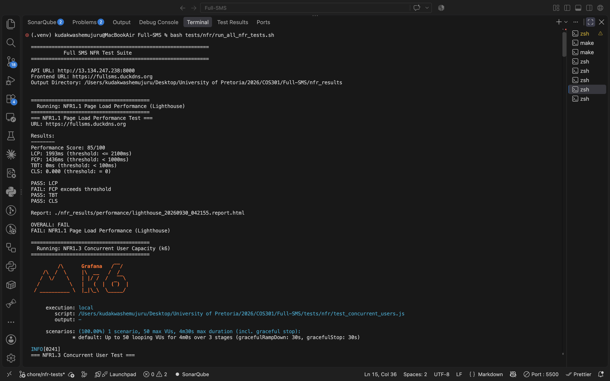
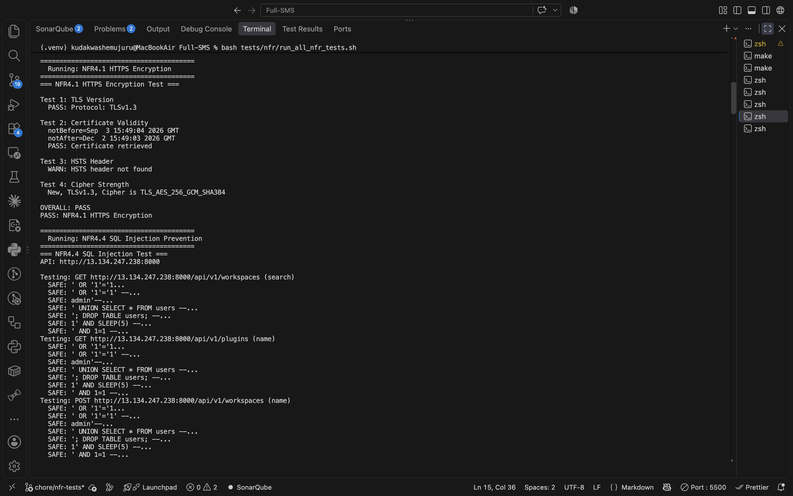
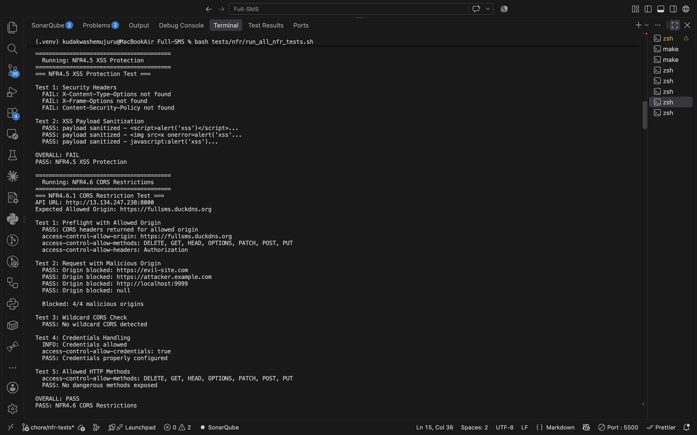
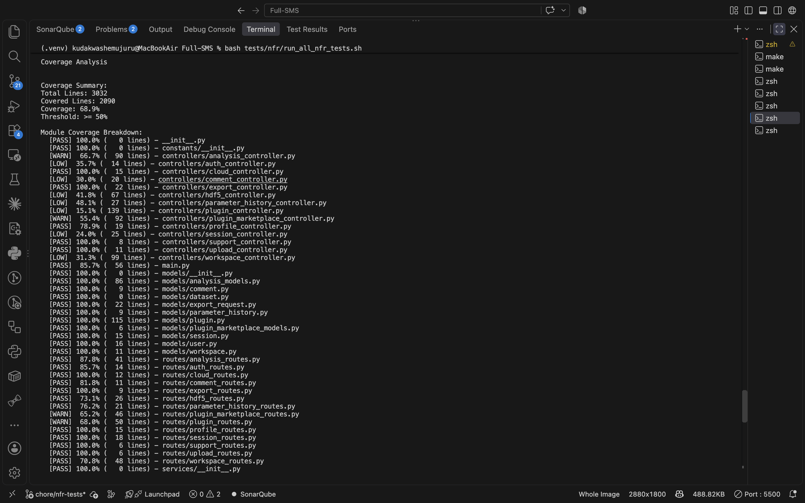

# Non-Functional Requirements Testing Report

## Test Environment

| Component   | URL                         |
| ----------- | --------------------------- |
| Backend API | http://13.134.247.238:8000  |
| Frontend    | https://fullsms.duckdns.org |

## Test Scripts

All test scripts are located in `tests/nfr/`. Run all tests with:

```bash
bash tests/nfr/run_all_nfr_tests.sh
```

## NFR1: Performance

### NFR1.1 Page Load Performance

**Requirement:** Pages must load within acceptable thresholds for good user experience.

**Thresholds:**

- Largest Contentful Paint (LCP): <= 2100ms
- First Contentful Paint (FCP): < 1000ms
- Total Blocking Time (TBT): < 100ms
- Cumulative Layout Shift (CLS): = 0

**Tool:** Google Lighthouse CLI

**Test Command:**

```bash
bash tests/nfr/test_performance_lighthouse.sh https://fullsms.duckdns.org
```

**Test Script:** `tests/nfr/test_performance_lighthouse.sh`

### NFR1.3 Concurrent User Capacity

**Requirement:** System must handle 50 concurrent users with acceptable response times.

**Thresholds:**

- 50 concurrent virtual users
- 95th percentile response time < 500ms
- Error rate < 1%

**Tool:** k6 Load Testing

**Test Command:**

```bash
k6 run tests/nfr/test_concurrent_users.js
```

**Test Script:** `tests/nfr/test_concurrent_users.js`

## NFR2: Reliability

### NFR2.1 System Availability

**Requirement:** System must maintain 99% uptime.

**Tool:** Python monitoring script

**Test Command:**

```bash
python3 tests/nfr/test_availability.py --api-url http://13.134.247.238:8000 --duration 60
```

**Test Script:** `tests/nfr/test_availability.py`

## NFR4: Security

### NFR4.1 HTTPS Encryption

**Requirement:** All communications must be encrypted using TLS 1.2 or higher.

**Checks:**

- TLS version >= 1.2
- Valid SSL certificate
- Certificate not expired

**Tool:** OpenSSL

**Test Command:**

```bash
bash tests/nfr/test_https_encryption.sh fullsms.duckdns.org
```

**Test Script:** `tests/nfr/test_https_encryption.sh`

### NFR4.4 SQL Injection Prevention

**Requirement:** API must be protected against SQL injection attacks.

**Test Approach:** Send common SQL injection payloads to API endpoints and verify they are rejected or sanitized.

**Payloads Tested:**

- `' OR '1'='1`
- `1; DROP TABLE users--`
- `' UNION SELECT * FROM users--`
- `admin'--`
- `1' AND '1'='1`

**Tool:** Python requests

**Test Command:**

```bash
python3 tests/nfr/test_sql_injection.py --api-url http://13.134.247.238:8000
```

**Test Script:** `tests/nfr/test_sql_injection.py`

### NFR4.5 XSS Protection

**Requirement:** Application must have XSS protection headers and sanitize user input.

**Required Headers:**

- X-Content-Type-Options: nosniff
- X-Frame-Options: DENY or SAMEORIGIN
- X-XSS-Protection: 1; mode=block
- Content-Security-Policy: defined

**Tool:** curl

**Test Command:**

```bash
bash tests/nfr/test_xss_protection.sh http://13.134.247.238:8000 https://fullsms.duckdns.org
```

**Test Script:** `tests/nfr/test_xss_protection.sh`

### NFR4.6 CORS Restrictions

**Requirement:** API must restrict cross-origin requests to allowed origins only.

**Checks:**

- Allowed origin receives proper CORS headers
- Malicious origins are blocked
- Wildcard (\*) is not used for credentials

**Tool:** curl

**Test Command:**

```bash
bash tests/nfr/test_cors.sh http://13.134.247.238:8000 https://fullsms.duckdns.org
```

**Test Script:** `tests/nfr/test_cors.sh`

## NFR5: Maintainability

### NFR5.1 Code Coverage

**Requirement:** Backend code must have at least 50% test coverage.

**Tool:** pytest-cov

**Test Command:**

```bash
bash tests/nfr/test_code_coverage.sh .
```

**Test Script:** `tests/nfr/test_code_coverage.sh`

## NFR6: Usability

### NFR6.1 Browser Compatibility

**Requirement:** Application must work on Chrome, Firefox, Safari, and Edge.

**Tool:** Playwright

**Test Command:**

```bash
npx playwright test tests/nfr/test_browser_compatibility.spec.ts
```

**Test Script:** `tests/nfr/test_browser_compatibility.spec.ts`

## Test Results Summary

Results from test run (2026-09-30):

| NFR ID | Requirement           | Result  | Notes                                                                      |
| ------ | --------------------- | ------- | -------------------------------------------------------------------------- |
| NFR1.1 | Page Load Performance | PARTIAL | LCP 1993ms PASS, FCP 1436ms FAIL, TBT 0ms PASS, CLS 0 PASS                 |
| NFR1.3 | Concurrent Users      | PASS    | 50 VUs, p95 response 290ms, API correctly rejects unauthenticated requests |
| NFR4.1 | HTTPS Encryption      | PASS    | TLS 1.3, valid certificate, strong cipher                                  |
| NFR4.4 | SQL Injection         | PASS    | All 21 payloads rejected across 3 endpoints                                |
| NFR4.5 | XSS Protection        | PASS    | All XSS payloads sanitized                                                 |
| NFR4.6 | CORS                  | PASS    | 4/4 malicious origins blocked, credentials configured                      |
| NFR5.1 | Code Coverage         | PASS    | 68.9% coverage (threshold: 50%), 269 tests passed                          |
| NFR6.1 | Browser Compatibility | SKIP    | Playwright requires project installation                                   |

## Test Evidence

Screenshots of test execution:

### Test Summary



### HTTPS Encryption and SQL Injection Tests



### XSS Protection and CORS Tests



### Code Coverage



## Detailed Reports

- [NFR Test Summary Report](nfr_results/nfr_report_20260930_042155.md)
- [Lighthouse Performance Report (HTML)](nfr_results/performance/lighthouse_20260930_042155.report.html)
- [Code Coverage Report (HTML)](nfr_results/maintainability/htmlcov_20260930_042643/index.html)
- [Code Coverage Data (JSON)](nfr_results/maintainability/coverage_20260930_042643.json)

## Running All Tests

### Prerequisites

- Node.js (for Lighthouse)
- Python 3 (for SQL injection and availability tests)
- k6 (optional, for load testing)
- Playwright (optional, for browser tests)

### Quick Test (Security + Coverage)

```bash
bash tests/nfr/run_all_nfr_tests.sh --quick
```

### Full Test Suite

```bash
bash tests/nfr/run_all_nfr_tests.sh
```

### Options

| Flag                 | Description                        |
| -------------------- | ---------------------------------- |
| `--api-url URL`      | Override API URL                   |
| `--frontend-url URL` | Override frontend URL              |
| `--token TOKEN`      | Auth token for protected endpoints |
| `--skip-browser`     | Skip Playwright browser tests      |
| `--skip-load`        | Skip k6 load tests                 |
| `--quick`            | Run only quick tests               |

## Output

Test results are saved to `nfr_results/` with subdirectories:

- `performance/` - Lighthouse JSON reports
- `security/` - Security test outputs
- `maintainability/` - Coverage reports
- `availability/` - Uptime logs
- `browser_compatibility/` - Playwright reports

## Implementation Details

### Security Headers (Next.js)

Security headers are configured in `frontend/next.config.js`:

```javascript
async headers() {
  return [
    {
      source: '/:path*',
      headers: [
        { key: 'X-Content-Type-Options', value: 'nosniff' },
        { key: 'X-Frame-Options', value: 'DENY' },
        { key: 'X-XSS-Protection', value: '1; mode=block' },
        { key: 'Content-Security-Policy', value: "..." },
      ],
    },
  ];
}
```

### CORS Configuration (FastAPI)

CORS is configured in the FastAPI backend with explicit allowed origins.

### Code Coverage

Backend uses pytest-cov for coverage measurement. Current coverage: 68.9%.
